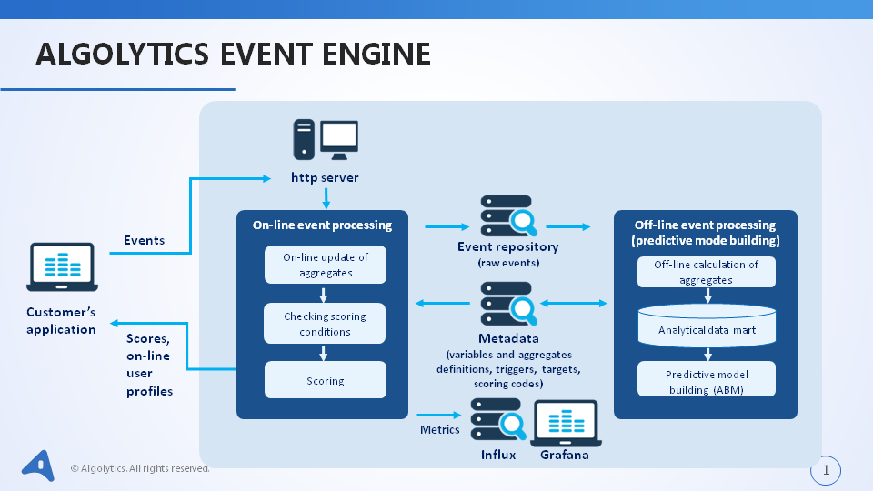

# How the engine works #
### Scheme of system action ###
Client's application sends statements (events) to the engine in JSON format through HTTP connection (REST API). Events get to the engine through Kafka queue. Each event is saved to repository in order to enable off-line processing.
#### On-line mode ####

- An event is transformed into variables (see [chapter 3](http://event-engine-documentation.readthedocs.io/en/latest/3.%20Statements/))
- Values of given user aggregates are refreshed
- Scoring conditions are checked for each model (conditions starting evaluation of scoring and conditions checking, whether the given user should be scored by a given model)
- For every model fulfilling scoring conditions a line of data is prepared
- Score calculation
- Returning score to the client

#### Off-line mode (automatic process, running at set time intervals) ####

- Counting of aggregates (based on saved statements) for each user and each model
- In analytical table containing calculated aggregates and target value a line of data may be created for each user. For some users this line will not be created, since:
	-  Scoring condition will not be fulfilled
	-  Conditions of target window calculating will not be fulfilled (for example: the target window counts for 3 days, while data contain events happening in only 2 days)
- For each model a separate analytical table is created
- The analytical table is an input to an ABM model counting process
- Chosen models are automatically deployed

#### Graphical diagram of system action ####

