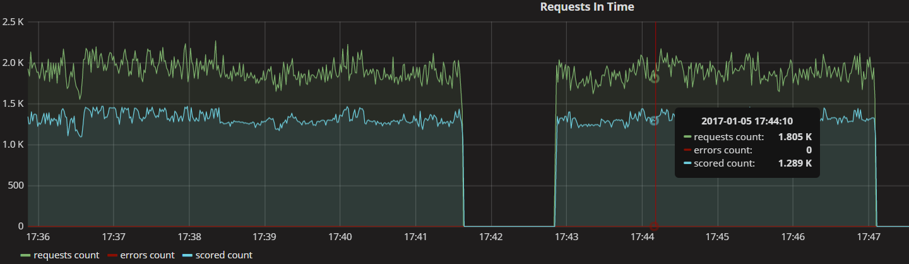
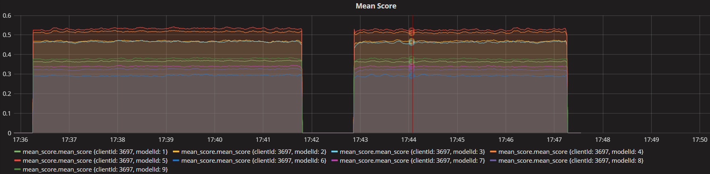

# Visualisation - EVE Metrics #
### How it works ###
To perform visualization, the Event Engine needs **influxDB** and **grafana** (tested on influxDB 1.1.1 and grafana 4.0.2 versions). Metrics are passed to **influxDB** by **EVE\_Core** application, and then they are visualized by **grafana**. All requests processed by **EVE\_Core** in specified time are passed to **Metric Processor**, that counts statistics and saves them in **influxDB** database. **EVE\_Core** passes a JSON request, JSON response, clientId and request type to the **Metric Processor**. In **grafana**, **influx** is defined as **DataSource**, from which metrics are downloaded. **EVE\_Core** do not connect with **grafana**.

### Configuration ###
**Influx** parameters are defined in **EVE\_Core** config file. 

List of parameters:

- **influx\_db\_url** = http://127.0.0.1:8086
- **influx\_db\_user** =
- **influx\_db\_password** =
- **influx\_db\_database** =
- **influx\_db\_retention\_policy** (see [influxDB documentation](https://docs.influxdata.com/influxdb/v0.9/query_language/database_management/#retention-policy-management)) = 
- **metric\_time\_window** (defines how often metrics will be sent to influx, defined in seconds) = 1

### Available metrics ###
#### Processed Requests Metric ####
This metric presents the number of processed requests in specified time window (defined as **metric\_time\_window** parameter), including the number of incorrect requests and scored request.

#### Mean Score Metric ####
This metric presents mean score for every clientId and modelId in 10 second time window, with shift defined in **metric\_time\_window** parameter.

